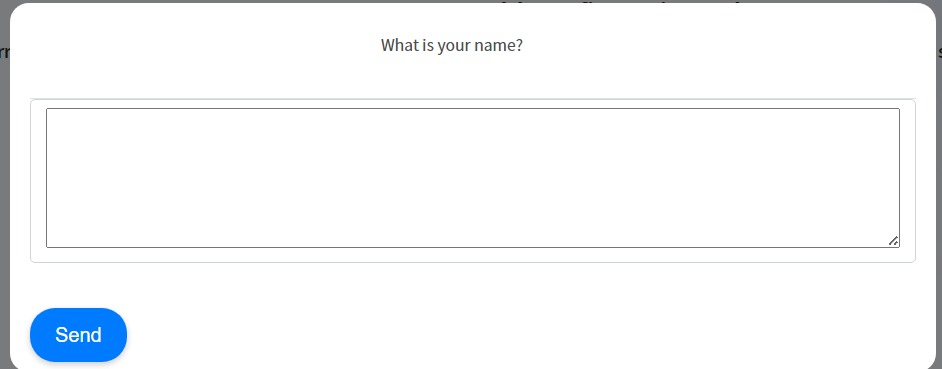

## Blazor Semantic Kernel Plugins
An RCL that combines Semantic Kernel's native functions alongside Blazor to allow LLMs to interact with a user interface.

### Getting Started

1. Add the following to your `Program.cs` file in your Blazor project:
```csharp
builder.Services.AddAskUserService();
```

2. Add the following to the bottom your App.razor (.net 7 or lower) or Routes.razor (.net 8):
```csharp
<SkPluginComponents.AskUser />
```

3. Inject `AskUserService` into any class or component in which you invoke Kernel functions. The following is the simplest implementation, but like any other native function, it can be called by any Semantic Kernel planner, using OpenAI Function Calling, or inside a prompt template. 
```
@using SkPluginComponents.Models
@using SkPluginComponents
@inject AskUserService AskUserService
<button @onclick=AskUser>Ask User</button>
<p>
    Answer: @_answer
</p>
@code {
    private string? _answer;
    private async Task AskUser()
    {
        var askUserPluginObject = new AskUserPlugin(AskUserService);
        var kernel = Kernel.CreateBuilder().Build();
        var plugin = kernel.ImportPluginFromObject(askUserPluginObject);
        var kernelArgs = new KernelArguments() { ["question"] = "What is your name?", ["inputType"] = "Text" };
        var result = await kernel.InvokeAsync<string>(plugin["AskUser"], kernelArgs);
        _answer = result;
    }
}

```
Execution of the function will display a modal with the question. The input type specified in the `kernelArgs` object will determine the type of the input component. The user's response will be returned as a string.

